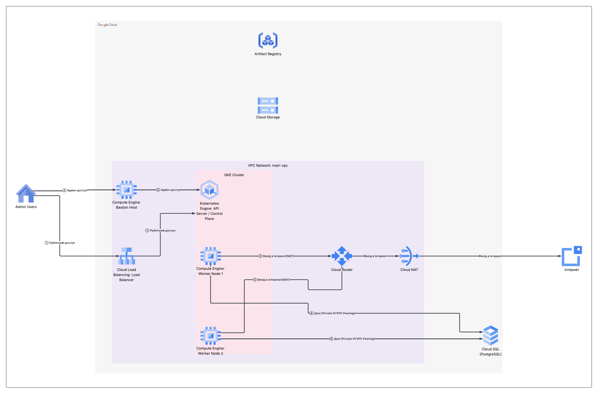

# Cloud-Native Infrastructure Automation with GCP & Terraform


Цей репозиторій містить вихідний код для диплому/пет-проекту на тему автоматизації розгортання захищеної хмарної інфраструктури в Google Cloud Platform з використанням підходів Infrastructure as Code (IaC) та Zero Trust.

## 🏗 Архітектура проекту

Проект розгортає виробничо-готову (production-ready) інфраструктуру:

1. **VPC Network**: Приватна мережа з налаштованим балансувальником навантаження (Ingress) та Cloud NAT.
2. **Google Kubernetes Engine (GKE)**: Приватний кластер з використанням Workload Identity та автомасштабуванням.
3. **Cloud SQL (PostgreSQL)**: База даних, доступна лише через приватну IP-адресу з Cloud SQL Proxy.
4. **IAM та Безпека**: Використання принципу найменших привілеїв (PoLP), Workload Identity Federation (WIF) та Secret Manager.



## ✨ Основні можливості (Features)

- **Zero Secrets Leakage**: Жодних довгострокових ключів або паролів у коді. Застосовується Workload Identity Federation та Secret Manager CSI Driver.
- **Micro-segmentation**: Всі ресурси розміщені в приватних підмережах без доступу з Інтернету.
- **Hands-off CI/CD**: Повний конвеєр розгортання через GitHub Actions, включаючи TFLint, Trivy vulnerability planner та Docker build/push.
- **Observability**: Cloud Logging (Fluentd), Cloud Monitoring та стек Prometheus + Grafana розгортається автоматично.
- **Distroless Images**: Мінімалістичні та безпечні Docker-образи веб-застосунку на основі `distroless`.

## 🛠 Prerequisites (Необхідні інструменти)

Для самостійного розгортання вам знадобляться:
- [Google Cloud CLI (`gcloud`)](https://cloud.google.com/sdk/docs/install)
- Плагін для GKE: `gcloud components install gke-gcloud-auth-plugin`
- [Terraform](https://developer.hashicorp.com/terraform/downloads) (≥ 1.5.0)
- [kubectl](https://kubernetes.io/docs/tasks/tools/)
- [Helm](https://helm.sh/docs/intro/install/) (опціонально, для моніторингу)

## 🚀 Deployment Guide (Керівництво з розгортання)

### 1. Ініціалізація інфраструктури (Terraform)
Перейдіть до директорії `environments/dev` (або туди, де знаходиться ваш `main.tf` оркестратора) і виконайте:
```bash
terraform init
terraform plan
terraform apply
```

### 2. Отримання облікових даних GKE
Після розгортання Terraform отримайте конфіг `kubectl`:
```bash
gcloud container clusters get-credentials gke-pet-cluster --zone europe-west1-b --project <YOUR_PROJECT_ID>
```

### 3. Автоматичне розгортання (CI/CD Pipeline)
Пайплайн в `.github/workflows/ci-cd.yml` потребує наступних секретів у вашому GitHub репозиторії:
- `WORKLOAD_IDENTITY_PROVIDER`: формат `projects/123456789/locations/global/workloadIdentityPools/github-pool/providers/github-provider`
- `SERVICE_ACCOUNT`: email сервісного акаунта GitHub Actions.

Будь-який прямий коміт або Merge у гілку `main` автоматично ініціює створення та розгортання застосунку.

## 📊 Observability Stack (Моніторинг)

Проект має вбудовану інтеграцію з Prometheus та Grafana за допомогою Helm.
Щоб розгорнути стек спостережуваності:

```bash
chmod +x scripts/install-monitoring.sh
./scripts/install-monitoring.sh
```

**Доступ до панелі Grafana:**
1. Прокиньте порт:
   ```bash
   kubectl port-forward svc/prometheus-grafana 3000:80 -n monitoring
   ```
2. Відкрийте в браузері `http://localhost:3000`
3. Увійдіть з обліковими даними за замовчуванням (User: `admin`, Password: `prom-operator`).

## 🧹 Cleanup (Знищення ресурсів)

Щоб уникнути зайвих витрат в GCP, обов'язково знищуйте інфраструктуру після тестування:
```bash
terraform destroy -auto-approve
```

---
*Розроблено в рамках курсової роботи/дипломного проекту. НТУУ «КПІ» - 2025.*
