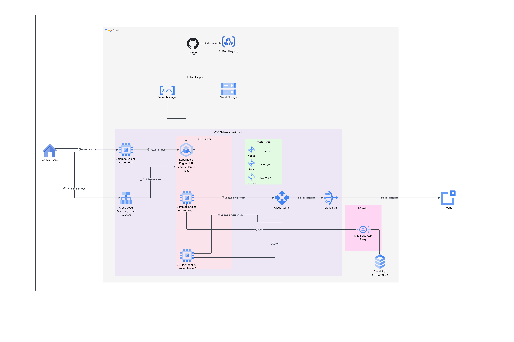

# Cloud-Native Infrastructure Automation with GCP & Terraform


This repository contains the source code for a thesis / pet project focused on automating the deployment of a secure cloud infrastructure on Google Cloud Platform (GCP) using Infrastructure as Code (IaC) and Zero Trust principles.

## 🏗 Project Architecture

The project deploys a production-ready infrastructure:

1. **VPC Network**: A private network with a configured Load Balancer (Ingress) and Cloud NAT.
2. **Google Kubernetes Engine (GKE)**: A private cluster leveraging Workload Identity and autoscaling.
3. **Cloud SQL (PostgreSQL)**: A database accessible exclusively via a private IP address using the Cloud SQL Proxy.
4. **IAM & Security**: Implementation of the Principle of Least Privilege (PoLP), Workload Identity Federation (WIF), and Secret Manager.



## ✨ Features

- **Zero Secrets Leakage**: No long-term keys or passwords in the source code. Utilizes Workload Identity Federation and the Secret Manager CSI Driver.
- **Micro-segmentation**: All resources are placed in private subnets with no direct internet access.
- **Hands-off CI/CD**: A complete deployment pipeline via GitHub Actions, including TFLint, Trivy vulnerability scanner, and Docker build/push.
- **Observability**: Cloud Logging (Fluentd), Cloud Monitoring, and a Prometheus + Grafana stack deployed automatically.
- **Distroless Images**: Minimalistic and secure web application Docker images based on `distroless`.

## 🛠 Prerequisites

To deploy this project independently, you will need:
- [Google Cloud CLI (`gcloud`)](https://cloud.google.com/sdk/docs/install)
- GKE auth plugin: `gcloud components install gke-gcloud-auth-plugin`
- [Terraform](https://developer.hashicorp.com/terraform/downloads) (≥ 1.5.0)
- [kubectl](https://kubernetes.io/docs/tasks/tools/)
- [Helm](https://helm.sh/docs/intro/install/) (optional, for monitoring)

## 🚀 Deployment Guide

### 1. Infrastructure Initialization (Terraform)
Navigate to the `environments/dev` directory (or wherever your orchestrator `main.tf` is located) and run:
```bash
terraform init
terraform plan
terraform apply
